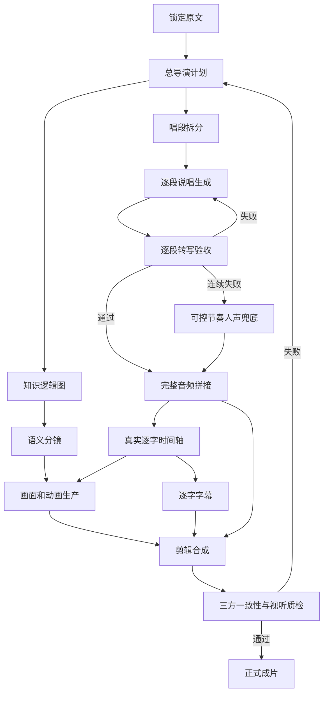

# 生产架构

## 状态流

## 依赖规则

1. 视觉概念可与音频并行，但精确动画和字幕必须等待最终人声时间轴。
2. 音频候选不能直接成为正式素材；先转写、再比较、再决定。
3. 字幕是显示层，不是真相修复层。声音唱错必须重做声音。
4. 画面不能只重复字幕，应把“很多内容但没击中关键问题”等抽象关系转成可见状态。
5. 导出是质量门后的动作，不是发现错误的第一处。

## 视觉语法

- 数量或堆积：卡片、节点、页面逐拍累积。
- 聚焦或筛选：杂乱信息收缩到一个发光目标。
- 因果：箭头、路径和结果依次点亮。
- 三项清单：三个独立视觉对象依拍出现。
- 对比：分屏、颜色系统、不同运动方向。
- 决策点：镜头推近具体问题，其他元素降暗。
- 结论：减少元素，保留一句记忆句和单一动作。

## 团队交接

每个角色只修改自己的文件。总导演通过项目配置和验收表接收结果，不以聊天记录作为唯一交接依据。所有候选保留来源、版本、生成时间和状态，正式素材用 `final` 标记。

